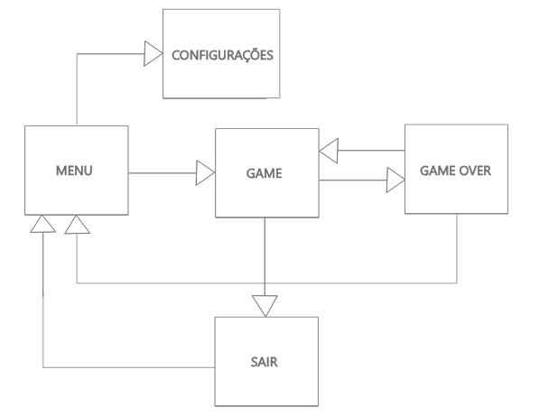

# Space_Forza

**Nome**: Space Forza.

**Gênero**: Ação.

**Público alvo**: Público que seja fã de jogos de espaço.

**Objetivo geral**: Fazer a viagem espacial da forma mais segura.

**Objetivos específicos**: Em busca do planeta perdido.

**Enredo e personagens**: O mundo está sendo destruído por conta das guerras, poluição... A empresa espacial brasileira Space Forza está
mandando os corajosos astronautas no foguete Power Forza One, para encontrar outro planeta que os seres humanos possam viver.

**Inimigo**: corpos celestes, extraterrestres
	
**Personagem Principal**: Foguete Power Forza One 

**Inimigos**: será os obstáculos que terá no espaço , como meteoros, extraterrestres, entre outros…

**Iteração de jogador**: Movimentar o foguete pelos perigosos corpos celestes.

**Controle**: Com o touch irá movimentar a nave pelo o espaço

**Regras do jogo com sistema de pontuação**: 

**Sistema de Ponto**:  A distância de anos luz que é percorrido.

**Sistema de Vida**: Será uma barra de vida, que irá diminuir de acordo que bater nos corpos celestes.

**Jogo acaba**: Será quando a barra de vida chegar a 0 

